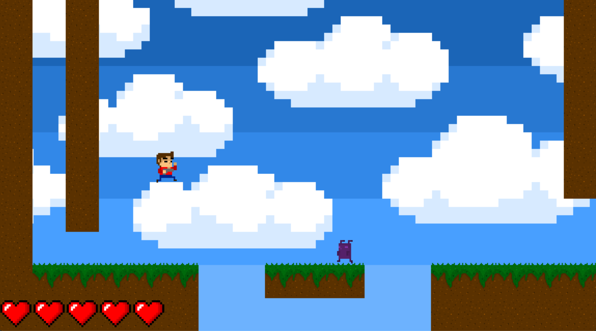

# PygamePlatformer


_PygamePlatformer_ is a simple one-player 2D Fixed-Camera Platform Shooter

## Table of Contents

- [Features](https://github.com/hammadfarooqi/PygamePlatformer/#features)
- [Controls](https://github.com/hammadfarooqi/PygamePlatformer/#controls)
- [Technologies](https://github.com/hammadfarooqi/PygamePlatformer/#technologies)
- [Setup](https://github.com/hammadfarooqi/PygamePlatformer/#setup)

## Features

- **Checkpoints:** After losing one of three lives, the player respawns at the starting position of room they died in.
- **Recharable Gun:** Player carried a handgun that can have five outgoing bullets at any time and one-shots more simple enemies.
- **Saved Progress:** Local storage of the player's last room and number of lives.
- **Boss Fight:** The game ends with a boss fight against the _Glob Monster_ who becomes more and more powerful as its health decreases. 

## Controls
- **A, D** for left and right movement
- **W** to jump
- **Space** to shoot bullets (only five bullets can be airborne at a time)



## Technologies

- Pygame 

## Setup

In order to run a local instance of _PygamePlatformer_, first clone or download a copy of this repository and follow the instructions below.

To setup the dependencies for the application, run:
```
python3 -m pip install -U pygame --user
```

To start the game, run the main.py file
